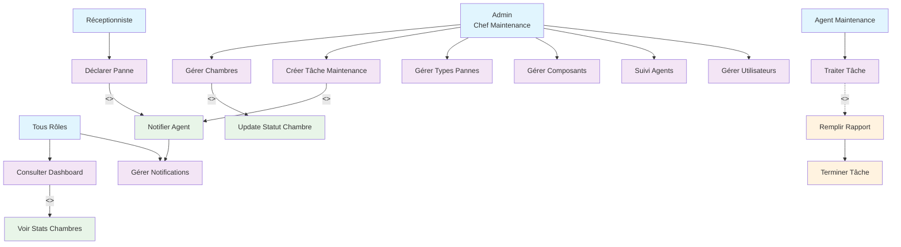
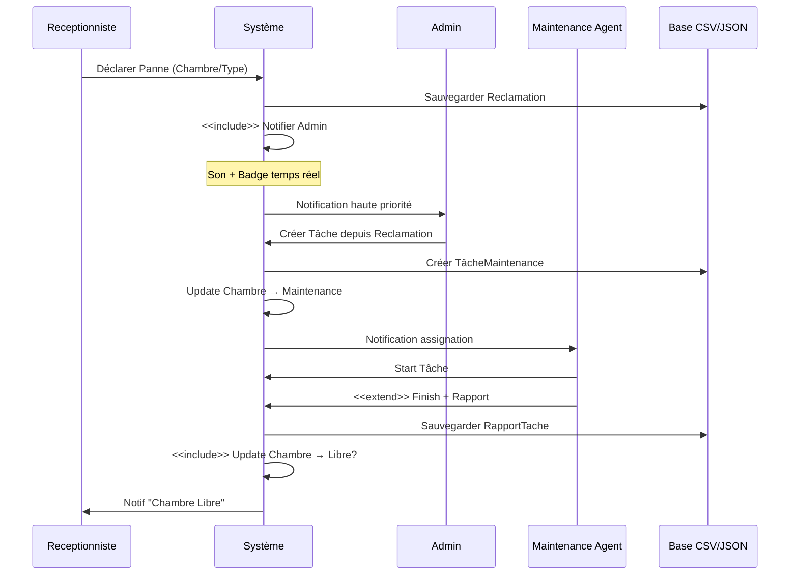
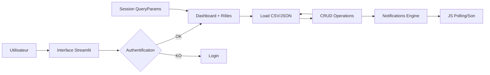

# 🏨 Diagrammes UML - Hotel Mediterranée PFE

## 1. **Diagramme de Classes** (Structure Données)

```mermaid
classDiagram
    class Utilisateur {
        +username: String
        +password: Hash
        +role: String (admin/reception/maintenance)
        +nom: String
        +authenticate()
        +hash_password()
    }

    class Chambre {
        +numero: String
        +type: String
        +aile: String
        +etage: int
        +statut: String (Libre/Occupée/Maintenance)
        +update_status()
        +get_history()
    }

    class TacheMaintenance {
        +id: int
        +chambre: String
        +description: String
        +type_panne: String
        +assigned_to: String
        +statut: String (En_attente/En_cours/Terminé)
        +priorite: String (Haute/Moyenne/Basse)
        +date_creation: DateTime
        +date_completion: DateTime
        +duree_estimee: float
        +update_status()
        +create()
    }

    class TypePanne {
        +id: int
        +nom_panne: String
        +description: String
        +priorite: String
    }

    class Composant {
        +id: int
        +chambre: String
        +composant_principal: String
        +sous_composant: String
        +statut: String (Bon/Dégradé/Cassée)
        +date_installation: Date
        +derniere_maintenance: Date
    }

    class Reclamation {
        +id: int
        +chambre: String
        +type_panne: String
        +description: String
        +statut: String
        +creé_par: String
    }

    class Notification {
        +id: int
        +title: String
        +message: String
        +type: String (info/warning/error)
        +target_role: String
        +read: boolean
    }

    class RapportTache {
        +task_id: int
        +agent: String
        +rapport: String
        +duree_travail: float
        +pieces_utilisees: String
    }

    %% Associations
    Utilisateur ||--o{ TacheMaintenance : assigne
    Utilisateur ||--o{ Reclamation : crée
    Chambre ||--o{ TacheMaintenance : concerne
    Chambre ||--o{ Composant : contient
    TypePanne ||--o{ TacheMaintenance : type
    TacheMaintenance ||--|| RapportTache : génère
    Reclamation ||--o| TacheMaintenance : convertit_en
    Notification ||--o| Utilisateur : notifie
```

## 2. **Diagramme de Cas d'Utilisation** (Use Cases avec <<include>> <<extend>>)



## 3. **Séquence Typique : Déclarer Panne → Tâche → Rapport**



## 4. **Flux de Données (DFD Niveau 1)**



## 🔑 **Règles Métier (OCL-like)**
```
context Chambre inv:
    if statut = 'Maintenance' and no active_tasks then
        statut := 'Libre'

context TacheMaintenance inv high_priority_first:
    tasks.sort_by(priorite desc, date_creation desc)
```

**Fichiers créés :** `diagrammes_uml.md` (copier dans README ou docs/).

**Visualiser :** Colle le contenu Mermaid dans [mermaid.live](https://mermaid.live) ou GitHub Markdown.
